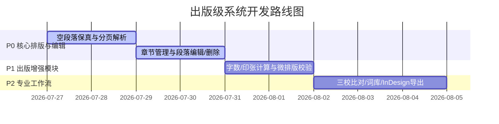

# 出版级文档解析、物理分页控制与出版工作流实施计划

面向出版行业标准，构建从文档导入、物理排版控制、段落编辑、微排版校验到专业排版导出的全流程系统。

## 阶段划分与优先级 (Phases & Priorities)

| 优先级 | 阶段 | 核心目标 |
| :--- | :--- | :--- |
| **P0 (高)** | **阶段一：核心排版与编辑** | 空段落 1:1 保留、分页符解析与自动开页、段落内联编辑与非空删除二次确认、1:1 高保真导出 |
| **P1 (中)** | **阶段二：出版计算与微排版校验** | 出版版面字数/印张估算、GB/T 15834 标点与微排版规范自动校验（避首尾、全半角、跨段引号） |
| **P2 (低)** | **阶段三：编校工作流与专业导出** | 三校留痕与版本 Diff 比对、出版合规专有名词库、InDesign (IDML/Tagged Text) 专业格式导出 |

---

## User Review Required

> [!IMPORTANT]
> 1. **P0 优先交付**：本次将立即开始执行 **P0 阶段** 的代码开发，包含后端数据库迁移、解析引擎升级、段落编辑/删除 API 和前端视图更新。
> 2. **P1/P2 渐进扩展**：P0 交付验证通过后，将按计划平滑推进 P1（印张/字数/标点校验）与 P2（三校比对/InDesign 导出）。

---

## Detailed Task Breakdown

### 阶段一：P0 - 核心解析、物理分页与编辑 (Phase 1 - Core Engine)

#### Backend Implementation
- **[database.py](file:///Users/zhonglei/Desktop/Project/%E8%A5%BF%E7%93%9C%E5%B0%91%E5%B9%B4/backend/app/core/database.py)**
  - Schema 迁移：`paragraphs` 表增加 `has_page_break_before INTEGER DEFAULT 0`。
  - CRUD 函数：`update_paragraph_text`、`toggle_paragraph_page_break`、`delete_paragraph_and_reorder`（平移重排后续 `idx` 及 `chapters` 索引边界）、`set_paragraph_as_chapter` / `unset_chapter`。
- **[document.py](file:///Users/zhonglei/Desktop/Project/%E8%A5%BF%E7%93%9C%E5%B0%91%E5%B9%B4/backend/app/core/document.py)**
  - 解析逻辑改动：保留空段落（不跳过 `text == ""`），精准提取 `<w:br w:type="page"/>` 及分节符。
  - 样式识别：扫描 `Heading 1~3` / `标题 1~3` 生成默认章节；Level-1 标题自动设置 `has_page_break_before = 1`（大章节开页规范）。
- **[projects.py](file:///Users/zhonglei/Desktop/Project/%E8%A5%BF%E7%93%9C%E5%B0%91%E5%B9%B4/backend/app/api/projects.py)**
  - 新增段落更新 `PATCH`、删除 `DELETE`、分页符切换 `POST`、章节标记 `POST` 接口。
- **[export.py](file:///Users/zhonglei/Desktop/Project/%E8%A5%BF%E7%93%9C%E5%B0%91%E5%B9%B4/backend/app/api/export.py)**
  - 导出引擎：按 `idx` 顺序写出段落（写回空行），遇到 `has_page_break_before == 1` 时写入 `add_break(WD_BREAK.PAGE)`。

#### Frontend Implementation
- **[api.js](file:///Users/zhonglei/Desktop/Project/%E8%A5%BF%E7%93%9C%E5%B0%91%E5%B9%B4/frontend/src/services/api.js)**
  - 封装 `updateParagraph`、`deleteParagraph`、`togglePageBreak`、`setChapter`、`unsetChapter`。
- **[ReviewReader.jsx](file:///Users/zhonglei/Desktop/Project/%E8%A5%BF%E7%93%9C%E5%B0%91%E5%B9%B4/frontend/src/components/ReviewReader.jsx)**
  - 左侧目录树：展示章节结构与分页节点。
  - 正文视图：渲染空段落高、渲染 **`-- 物理分页符 (Page Break) --`** 分隔线。
  - 段落交互：双击/编辑模式支持内联修改；非空段落删除二次确认 Modal 弹窗；快捷工具条。

---

### 阶段二：P1 - 出版计算与微排版校验 (Phase 2 - Publishing Audit)

#### [NEW] [publish_calc.py](file:///Users/zhonglei/Desktop/Project/%E8%A5%BF%E7%93%9C%E5%B0%91%E5%B9%B4/backend/app/core/publish_calc.py)
- 实现出版字数计算：版面字数公式 `行数 × 行字数 × 页数`，与实际字数双重统计。
- 实现开本印张计算：支持 16 开、大 32 开估算，返回印张数（如 12.5 印张）。

#### [NEW] [typography_checker.py](file:///Users/zhonglei/Desktop/Project/%E8%A5%BF%E7%93%9C%E5%B0%91%E5%B9%B4/backend/app/core/typography_checker.py)
- GB/T 15834 标点规范校验器：
  - 中英文/数字格式与全半角符检查。
  - 禁排字符与行首/行尾避饰规则检查。
  - 跨段引号未闭合自动修正。

---

### 阶段三：P2 - 编校工作流与专业导出 (Phase 3 - Professional Workflow)

#### [NEW] [version_diff.py](file:///Users/zhonglei/Desktop/Project/%E8%A5%BF%E7%93%9C%E5%B0%91%E5%B9%B4/backend/app/core/version_diff.py)
- 三校留痕与版本 Diff 比对：支持原稿与各校对版本间的逐段差异分析及可视化视图。

#### [NEW] [indesign_export.py](file:///Users/zhonglei/Desktop/Project/%E8%A5%BF%E7%93%9C%E5%B0%91%E5%B9%B4/backend/app/api/indesign_export.py)
- InDesign Tagged Text / IDML 导出模块：将带样式的段落与分页标签转换为 InDesign 导入格式。

---

## Verification Plan

### Automated Tests
- 后端 API 测试：
  - 验证 `parse_paragraphs` 对空行和 `<w:br>` 的解析记录。
  - 验证 `DELETE` 接口对后续 `idx` 和 `chapters` 范围的自动平移重排。
  - 验证 `export` 生成的 docx，用 `python-docx` 校验分页符数量。
- 印张计算与微排版单测：
  - 验证字数/印张计算逻辑。
  - 验证标点避饰与跨段引号检查器。

### Manual Verification
- **P0 功能验证**：导入含空行与大章节的 docx，检查目录树分页线、编辑段落、非空删除确认弹窗及导出还原。
- **P1 功能验证**：查看印张估算面板，校验标点规范检测结果。
- **P2 功能验证**：执行版本 Diff 比对，导出 InDesign 标签文件测试。
